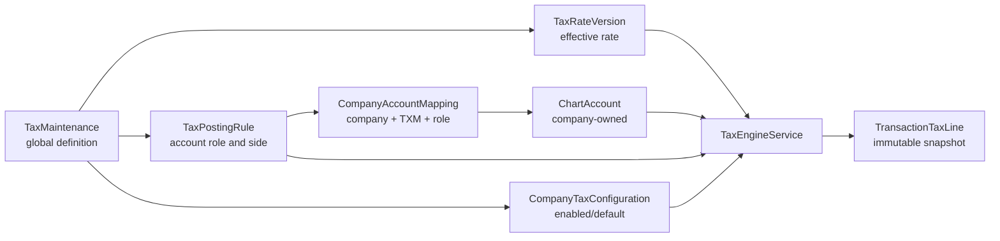

# Tax Backend Architecture

## Purpose

The Tax backend provides a global, jurisdiction-aware tax catalog while keeping
accounting ownership inside each company.

The architecture supports:

- VAT, GST, sales tax, percentage tax, withholding tax, and other systems;
- exclusive and inclusive calculations;
- effective-dated rates;
- multiple taxes on one transaction;
- configurable debit and credit posting rules;
- company-owned Chart of Accounts mappings;
- immutable tax snapshots for posted transactions; and
- reversals, proportional refunds, and adjustments.

`TaxMaintenance` remains the Prisma persistence name for compatibility. The
Nest module, routes, services, and public terminology use **Tax**.

## Core ownership rule

Tax definitions and accounting accounts have different owners:

| Data                      | Owner              | Examples                                                      |
| ------------------------- | ------------------ | ------------------------------------------------------------- |
| Tax definition            | Global platform    | Philippine VAT, Canadian GST, zero-rated VAT                  |
| Rate version              | Global platform    | 12% effective in 2026, 13% effective in 2028                  |
| Posting rule              | Global platform    | Purchase VAT posts to `INPUT_TAX_ACCOUNT` as a debit          |
| Company tax configuration | Company            | Enable a tax, choose sale/purchase defaults                   |
| Account-role mapping      | Company            | `INPUT_TAX_ACCOUNT` points to the company's Input VAT account |
| Transaction tax snapshot  | Posted transaction | Applied rate, amount, account, title, and entry side          |

A global Tax definition must never hold a company Chart of Accounts ID.

## Architecture



## Data model

### `TaxMaintenance`

Represents the stable identity and legal behavior of a tax.

Important fields:

| Field                   | Purpose                                                    |
| ----------------------- | ---------------------------------------------------------- |
| `code`                  | Stable global identifier                                   |
| `name`                  | Display name                                               |
| `jurisdictionCode`      | Country or jurisdiction identifier                         |
| `taxSystem`             | VAT, GST, sales tax, withholding, percentage tax, or other |
| `treatment`             | Standard, reduced, zero-rated, exempt, or out of scope     |
| `transactionScope`      | Sale, purchase, or both                                    |
| `percentage`            | Backward-compatible current/default percentage             |
| `calculationMethod`     | Exclusive or inclusive                                     |
| `recoverable`           | Backward-compatible recoverability flag                    |
| `sourceTemplateCode`    | Seed-template provenance                                   |
| `sourceTemplateVersion` | Seed-template release                                      |
| `sortOrder`             | Global Tax List and dropdown display sequence              |
| `status`                | Active or inactive                                         |

The `percentage`, `calculationMethod`, and `recoverable` fields remain for
existing API compatibility. New calculations resolve an effective
`TaxRateVersion`.

### `TaxRateVersion`

Separates a stable Tax identity from rates that change over time.

Important fields:

- `taxDefinitionId`;
- `percentage`;
- `calculationMethod`;
- `recoverablePercentage`;
- `effectiveFrom`;
- `effectiveTo`; and
- `status`.

Rules:

- effective periods for one Tax definition must not overlap;
- `effectiveTo` must be on or after `effectiveFrom`;
- a new future version closes the preceding open-ended version;
- calculations select the version using the transaction date; and
- posted transactions retain the selected version and applied values.

Example:

| Tax          | Percentage | Effective from | Effective to |
| ------------ | ---------: | -------------- | ------------ |
| Standard VAT |        12% | 2020-01-01     | 2027-12-31   |
| Standard VAT |        13% | 2028-01-01     | null         |

### `TaxPostingRule`

Defines how a Tax posts without hard-coding country-specific behavior in a
transaction module.

Important fields:

| Field              | Purpose                                                  |
| ------------------ | -------------------------------------------------------- |
| `transactionScope` | Sale or purchase                                         |
| `postingEvent`     | Recognition, settlement, refund, reversal, or adjustment |
| `accountRole`      | Logical company-account role                             |
| `entrySide`        | Debit or credit                                          |
| `amountSource`     | Tax, recoverable, or withheld amount                     |
| `priority`         | Deterministic ordering                                   |
| `isActive`         | Operational availability                                 |

Example VAT recognition rules:

| Scope    | Account role         | Side   |
| -------- | -------------------- | ------ |
| Purchase | `INPUT_TAX_ACCOUNT`  | Debit  |
| Sale     | `OUTPUT_VAT_ACCOUNT` | Credit |

Other jurisdictions can add roles and rules without changing the calculation
engine.

### `CompanyTaxConfiguration`

Controls which global definitions a company may use.

It stores:

- enabled/disabled state;
- default-for-sales state;
- default-for-purchases state; and
- an optional jurisdiction registration number.

Only one company Tax configuration should be the default for a given scope.

### `CompanyAccountMapping`

Connects a logical posting role to a company-owned Chart of Accounts record.

The unique business key is:

```text
companyId + moduleCode ("TXM") + accountRole
```

The mapped Chart Account must:

- belong to the same company;
- be active;
- not be deleted; and
- be a posting account.

Account titles are company-owned. Tax configuration resolves accounts by ID
and role, never by mutable account title.

Philippine default roles are:

- `INPUT_TAX_ACCOUNT`;
- `OUTPUT_VAT_ACCOUNT`;
- `DEFERRED_VAT_ACCOUNT`;
- `EXPANDED_WITHHOLDING_TAX_ACCOUNT`;
- `CREDITABLE_WITHHOLDING_TAX_ACCOUNT`;
- `WITHHOLDING_VATABLE_TAX_ACCOUNT`; and
- `FINAL_WITHHOLDING_TAX_ACCOUNT`.

Posting rules may introduce additional roles for other jurisdictions.

### `TransactionTaxLine`

Stores the immutable tax and posting facts used by a posted transaction.

The model uses `sourceType` and `sourceId` so different transaction modules can
use the same tax engine before a shared journal aggregate exists.

Snapshots include:

- Tax definition and rate-version IDs;
- Tax code, name, and jurisdiction;
- percentage and calculation method;
- taxable, tax, and recoverable amounts;
- posting account ID, code, and title;
- posting account role and debit/credit side;
- currency and transaction date; and
- original Tax line linkage for revisions.

Historical reports must read these snapshots. They must not recalculate posted
documents from current Tax configuration.

## Calculation behavior

The engine uses `Prisma.Decimal`; do not use binary floating-point arithmetic
for accounting values.

### Exclusive tax

```text
taxAmount = inputAmount * percentage / 100
taxableAmount = inputAmount
grossAmount = taxableAmount + taxAmount
```

### Inclusive tax

```text
taxAmount = inputAmount * rate / (1 + rate)
taxableAmount = inputAmount - taxAmount
```

### Zero-amount treatments

`ZERO_RATED`, `EXEMPT`, and `OUT_OF_SCOPE` calculate zero tax, but their legal
treatments remain distinct for reporting.

### Recoverable amount

```text
recoverableAmount = taxAmount * recoverablePercentage / 100
```

This supports fully recoverable, non-recoverable, and partially recoverable
input taxes.

### Rounding

Calculation accepts a currency scale from zero to six decimal places and uses
half-up decimal rounding. Callers should supply the correct minor-unit scale
for the transaction currency.

## Multiple taxes

`POST /tax/calculate` accepts an array of Tax selections. Each selection can
use its own taxable base.

Example purchase:

```text
Base expense                  100,000
Input VAT at 12%               12,000
Expanded withholding at 2%      2,000
Net payable                   110,000
```

Possible journal:

| Account                      |   Debit |  Credit |
| ---------------------------- | ------: | ------: |
| Expense or inventory         | 100,000 |         |
| Input VAT                    |  12,000 |         |
| Expanded withholding payable |         |   2,000 |
| Accounts payable             |         | 110,000 |

Tax only produces its Tax posting lines. The owning transaction module remains
responsible for the expense, revenue, receivable, payable, cash, and balancing
entries.

## Transaction lifecycle

### Original posting

1. Resolve the company and transaction date.
2. Select one or more enabled Tax definitions.
3. Resolve effective rate versions.
4. Calculate amounts.
5. Resolve active posting rules.
6. Resolve company account mappings.
7. Build the complete balanced journal in the transaction module.
8. Persist immutable `TransactionTaxLine` snapshots in the same database
   transaction as the journal.

### Reversal

`reverseTransactionTaxes` copies the original snapshots and swaps debit and
credit. It does not use the current rate or current account mapping.

### Refund

`refundTransactionTaxes` creates proportional opposite-side entries from the
original snapshots. The proportion must be greater than zero and no more than
one.

### Adjustment

`adjustTransactionTaxLine` stores only the absolute difference between the
original and corrected amount. An increase retains the original side; a
decrease uses the opposite side.

Revisions link to the original `TransactionTaxLine`.

## API

All routes use the versioned Tax controller. Tax routes are authenticated with
`JwtAuthGuard`; do not mark Tax lookup, autocomplete, metadata, source-key, or
default-account endpoints as `@Public()`. Tax is reference/catalog data for
authenticated application workflows, not anonymous public content.

| Method and route                       | Purpose                                                                            |
| -------------------------------------- | ---------------------------------------------------------------------------------- |
| `GET /tax`                             | List global Tax definitions                                                        |
| `GET /tax/autocomplete`                | List Tax autocomplete options                                                      |
| `GET /tax/transaction-types`           | List distinct Tax transaction types                                                |
| `GET /tax/tax-types`                   | List distinct Tax types                                                            |
| `GET /tax/party-default-classifications` | List Party Management tax default buckets                                        |
| `GET /tax/:sourceKey`                  | Get one global Tax definition                                                      |
| `POST /tax`                            | Create a global Tax definition and initial rate                                    |
| `PATCH /tax/:id`                       | Update definition metadata and version rate changes made through the legacy fields |
| `POST /tax/:id/rates`                  | Create an effective-dated rate version                                             |
| `POST /tax/:id/posting-rules`          | Create or update a posting rule                                                    |
| `PATCH /tax/:id/company-configuration` | Enable Tax and set company defaults                                                |
| `GET /tax-default-accounts`            | List tax codes with company resolved posting accounts                              |
| `GET /tax-default-accounts/:sourceKey` | Get one tax code with company resolved posting accounts                            |
| `PATCH /tax/account-mappings`          | Map any active posting-rule role to a company account                              |
| `PATCH /tax/reorder`                   | Persist the complete global Tax List display order                                 |
| `POST /tax/calculate`                  | Calculate one or more taxes and resolve posting accounts                           |

All Tax writes are currently restricted to superadmins. Company configuration
and mapping operations additionally use the active company context and validate
company ownership.

## Service integration

`TaxService` and `TaxEngineService` are exported by `TaxModule` as stable,
thin orchestration façades. Focused module services own the implementation:

| Service                          | Responsibility                                                     |
| -------------------------------- | ------------------------------------------------------------------ |
| `TaxAccessService`               | Tax maintenance policy, active-company context, and company access |
| `TaxCatalogService`              | Definition listing, CRUD, statistics, and display ordering         |
| `TaxCompanyConfigurationService` | Company availability, defaults, and company-owned account mappings |
| `TaxRateService`                 | Effective-dated rate creation and current-rate synchronization     |
| `TaxPostingRuleService`          | Jurisdiction posting-rule maintenance                              |
| `TaxCalculationService`          | Effective-rate calculation and posting-account resolution          |
| `TaxTransactionService`          | Immutable snapshots, reversals, refunds, and adjustments           |

Pure normalization and arithmetic stay under `utils/`; API response shaping
stays under `mappers/`; Prisma include contracts stay under `prisma/` and
module-owned payload contracts stay under `types/`. UTC date-only parsing uses
the shared `src/common/utils/date.util.ts` helper.

`TaxController` must stay thin and guarded:

- decorate the controller with `@UseGuards(JwtAuthGuard)`;
- import `AuthModule` and `AccessControlModule` in `TaxModule` so guard
  dependencies are available;
- keep Prisma payload helper types in `src/modules/tax/types/`; and
- keep Tax response shaping in `src/modules/tax/mappers/`.

Transaction modules should use:

- `calculate` before posting or for previews;
- `recordTransactionTaxes` when committing an original journal;
- `reverseTransactionTaxes` for complete reversals;
- `refundTransactionTaxes` for proportional refunds; and
- `adjustTransactionTaxLine` for delta adjustments.

Persist journal entries and Tax snapshots in one Prisma transaction. A failure
must roll back both.

Party records retain tax registration and default purchase classification
metadata, but do not store a default or preferred transaction Tax. Transaction
modules select taxes using the document context and may apply more than one Tax.

The current backend does not yet have a single shared journal-posting pipeline.
Each persisted transaction module must explicitly integrate the Tax engine
until such a pipeline exists.

## Seeding and migration

The global seed creates the `PH-DEFAULT` template:

- 12% exclusive VAT;
- 12% inclusive VAT;
- zero-rated VAT;
- VAT exempt;
- 3% percentage tax; and
- no tax / out of scope.

For each seed definition, the seeder creates:

- the global Tax row;
- the initial effective rate version; and
- VAT-style purchase/sale posting rules where applicable.

Company Chart of Accounts bootstrap:

- creates missing Philippine default posting accounts;
- creates missing `TXM` company-account mappings without overwriting custom
  choices; and
- enables active global Tax definitions for the company.

The global migration:

- preserves legacy company account selections before globalizing Tax rows;
- fills missing mappings from each company's standard Chart of Accounts;
- creates rate versions, posting rules, company configurations, and transaction
  snapshot tables; and
- normalizes legacy definitions and account titles.

If a migration attempt is recorded as failed, mark it rolled back before
rerunning the corrected migration.

## Adding another jurisdiction

1. Define stable Tax codes and a jurisdiction code.
2. Seed or create global Tax definitions.
3. Add effective rate versions.
4. Add sale, purchase, recognition, settlement, and other required posting
   rules.
5. Enable the definitions for applicable companies.
6. Map every posting-rule account role to each company's Chart of Accounts.
7. Add tests for inclusive/exclusive tax, exemptions, recoverability, rounding,
   rate boundaries, multiple taxes, refunds, and reversals.
8. Keep statutory names and rates in configuration and seed data, not
   transaction code.

Do not add another country's behavior to the Philippine template.

## Invariants

- Tax codes are globally unique.
- Rates and recoverable percentages remain between zero and 100.
- Rate periods do not overlap.
- A transaction is a sale or purchase, never `BOTH`.
- A Tax must be active, enabled for the company, and valid for the transaction
  scope.
- Posting accounts belong to the company and are active posting accounts.
- Posted snapshots are immutable.
- Reversals and refunds use original snapshots.
- Global Tax definitions never reference company-owned account IDs.

## Module visibility

`TXM` is a platform facility and is not a customer-selectable sidebar module.
Tax is consumed by transactions and company configuration workflows.

`DA` (Default Accounts) remains an active module and sidebar entry. It is not
excluded with Tax.

## Key implementation files

| File                                                                                     | Responsibility                                            |
| ---------------------------------------------------------------------------------------- | --------------------------------------------------------- |
| `prisma/schema.prisma`                                                                   | Tax models, enums, relations, and constraints             |
| `prisma/migrations/20260723110000_global_tax_catalog_and_account_mappings/migration.sql` | Globalization and adaptive Tax migration                  |
| `src/modules/tax/tax.controller.ts`                                                      | Tax HTTP routes                                           |
| `src/modules/tax/tax.service.ts`                                                         | Catalog, versions, rules, configurations, and mappings    |
| `src/modules/tax/types/tax-prisma-payload.type.ts`                                       | Module-owned Prisma payload helper types                  |
| `src/modules/tax/tax-engine.service.ts`                                                  | Calculation, posting resolution, snapshots, and revisions |
| `src/modules/tax/seed/tax.seed.ts`                                                       | Global and company Tax defaults                           |
| `src/modules/tax/utils/tax-accounting-account.util.ts`                                   | Philippine-compatible account-role defaults               |
| `src/modules/maintenance/chart-of-accounts/seed/chart-of-accounts.seed.ts`               | Company accounts and missing Tax mappings                 |

## Verification checklist

After changing Tax:

1. Run Prisma format.
2. Validate the Prisma schema.
3. Generate the normal Prisma client.
4. Check migration history before deployment.
5. Run backend type checking.
6. Run Tax service and engine tests.
7. Run lint and the production build.
8. Verify exclusive and inclusive calculations.
9. Verify effective-date boundaries.
10. Verify company account ownership.
11. Verify multi-tax totals.
12. Verify reversal, refund, and adjustment snapshots.
13. Confirm posted documents never depend on current master data.

## Anti-patterns

Do not:

- hard-code statutory percentages in transaction services;
- derive legal treatment from a display name;
- overwrite historical rate versions;
- assign company Chart Account IDs to global Tax definitions;
- resolve posting accounts by title;
- calculate money with JavaScript floating-point arithmetic;
- post Tax lines without the transaction's balancing entries;
- recalculate posted documents using current configuration;
- use current mappings for a reversal or refund; or
- alphabetically reorder Tax dropdowns instead of using `sortOrder`; or
- overwrite a company's custom mapping during bootstrap.
