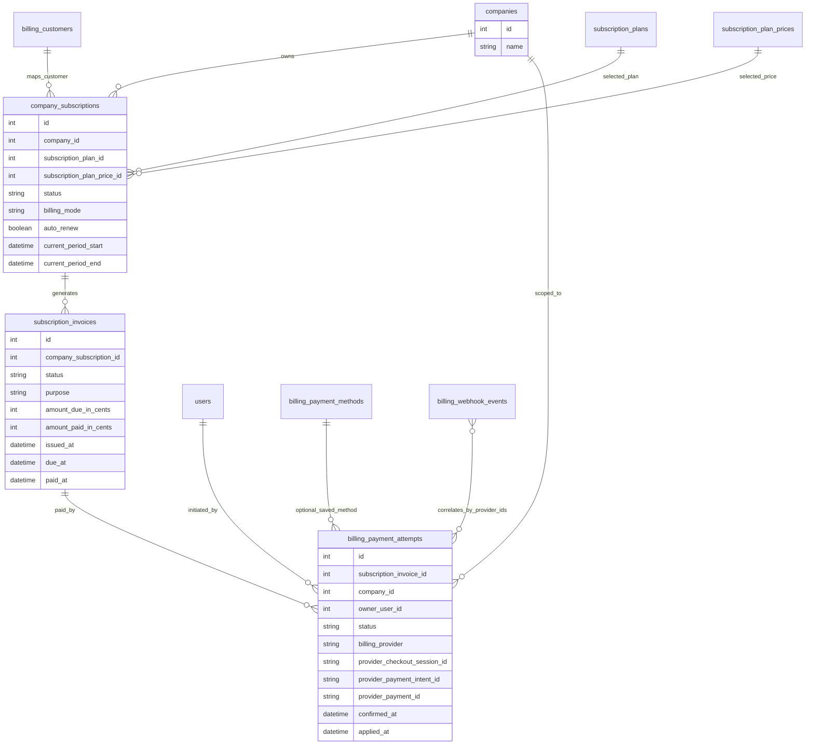

# PayMongo Payment Attempt Refactor Proposal

## Overview

This document reviews the current Phase 2 PayMongo Manual Billing implementation and proposes a cleaner long-term billing architecture.

No code, schema, or migration changes are included in this document.

The main recommendation is to refactor the current `billing_payment_requests` concept into a first-class `billing_payment_attempts` model, owned by an invoice. This better matches enterprise billing and accounting practice:

- An invoice represents what the customer owes.
- A payment attempt represents one attempt to pay that invoice.
- A webhook event records what PayMongo sent.
- A subscription represents the customer's active entitlement period.

## Current Architecture Review

### `company_subscriptions`

`company_subscriptions` currently represents the subscription state for a company.

It stores:

- company
- billing customer
- selected subscription plan
- selected plan price
- billing cycle
- billing mode
- auto-renew flag
- subscription status
- current period dates
- trial dates
- provider references for PayMongo subscription/customer/payment method
- latest invoice/payment intent references
- raw provider payload

This table is still useful as the runtime source for subscription state.

### `subscription_invoices`

`subscription_invoices` currently represents PayMongo subscription invoice records, mostly for the AUTO billing flow.

It stores:

- company subscription
- provider invoice id
- payment intent id
- invoice status
- billing reason
- amount due
- amount paid
- period start/end
- raw provider payload

Current limitation: manual checkout payments do not appear to be modeled as invoice-owned attempts. Manual payment state is currently centered around `billing_payment_requests`.

### `billing_payment_methods`

`billing_payment_methods` represents saved payment methods.

This should remain AUTO-only.

Manual checkout should not create saved payment methods because manual PayMongo Checkout is one-time payment and should not imply future auto-deduction.

### `billing_webhook_events`

`billing_webhook_events` stores raw PayMongo webhook payloads and processing metadata.

This is the correct responsibility:

- provider audit
- idempotency
- replay protection
- processing diagnostics

It should not become the business state table.

### `billing_payment_requests`

`billing_payment_requests` currently stores:

- payment purpose
- billing mode
- company
- owner user
- company subscription
- selected plan
- selected plan price
- amount
- checkout session id
- payment intent id
- payment id
- status
- success/cancel URLs
- raw provider payload
- payment timestamps

Functionally, this table is not just a request. It behaves as a payment attempt.

The current status enum already includes attempt lifecycle states:

- `PENDING`
- `AWAITING_PAYMENT`
- `PAID`
- `FAILED`
- `CANCELED`
- `EXPIRED`
- `APPLIED`

That lifecycle is closer to a payment attempt than a payment request.

### Current Manual Checkout Flow

Current manual checkout behavior is roughly:

1. Frontend requests manual checkout.
2. Backend creates a `billing_payment_requests` row.
3. Backend creates a PayMongo Checkout Session.
4. Backend updates the request with the checkout session id and provider payload.
5. User pays through PayMongo.
6. PayMongo sends webhook.
7. Webhook service finds the payment request.
8. Webhook service updates subscription/company/onboarding state.
9. Webhook service marks the request as `APPLIED`.

This works, but the webhook service currently mixes provider event handling with business application.

## Problems In The Current Implementation

### 1. `billing_payment_requests` Is Misnamed

The table name suggests a request to create a payment.

The stored data and status lifecycle are broader:

- checkout session state
- payment confirmation
- payment failure
- expiry/cancellation
- business application state

That is a payment attempt, not merely a request.

### 2. Manual Payments Are Not Clearly Invoice-Owned

The proposed accounting model should allow:

```text
Invoice #1001
  Attempt 1 - expired
  Attempt 2 - canceled
  Attempt 3 - paid and applied
```

The current model links manual payment requests directly to subscription, plan, and company. It does not make the invoice the obvious owner of payment attempts.

This makes future reconciliation, receipts, refunds, retries, and support workflows harder.

### 3. Payment Confirmation And Business Application Are Coupled

The desired distinction is:

- `PAID`: PayMongo confirmed money was paid.
- `APPLIED`: Gr8Books successfully applied the business changes.

Current webhook handling can move directly to `APPLIED` after subscription/company/onboarding changes succeed.

That means if PayMongo confirms payment but business processing fails partway through, the system needs a reliable way to preserve the paid state and retry application later.

### 4. Webhook Service Owns Too Much Business Logic

The webhook service should primarily:

- verify PayMongo event authenticity
- store the raw webhook event
- map provider event to internal payment state
- mark webhook event processed

It should not be the primary owner of:

- activating subscriptions
- activating companies
- completing onboarding billing
- extending subscription periods

Those should belong to an application service that applies a paid attempt idempotently.

### 5. Multiple Payment Attempts Per Invoice Are Not First-Class

Manual checkout needs retry behavior:

- user opens checkout and lets it expire
- user cancels checkout
- user retries with another method
- user succeeds

Those should be multiple attempts for the same invoice, not multiple independent payment obligations.

### 6. Provider Payload Duplication Needs Clear Boundaries

It is acceptable to store provider payloads in both webhook events and payment attempts, but each copy must have a clear purpose:

- `billing_webhook_events.rawPayload`: immutable event audit.
- `billing_payment_attempts.rawProviderPayload`: latest provider object snapshot for operational display/debugging.

Without that distinction, future maintenance becomes ambiguous.

### 7. Subscription Rows Contain Some Provider-Oriented Payment Fields

`company_subscriptions` currently stores fields such as latest invoice/payment intent references.

This is acceptable as denormalized operational state, but subscription should not become payment history. Payment history should live under invoices and attempts.

## Recommended Architecture

The recommended model is:

```text
Company
  -> CompanySubscription
    -> SubscriptionInvoice
      -> BillingPaymentAttempt
        -> PayMongo Checkout Session / Payment Intent / Payment
```

Supporting tables:

```text
BillingCustomer
BillingPaymentMethod
BillingWebhookEvent
SubscriptionPlan
SubscriptionPlanPrice
```

### Recommended Responsibility Split

| Table | Responsibility |
|---|---|
| `company_subscriptions` | Current subscription state and entitlement period |
| `subscription_invoices` | What the customer owes |
| `billing_payment_attempts` | One attempt to pay one invoice |
| `billing_payment_methods` | Saved reusable payment methods for AUTO billing |
| `billing_webhook_events` | Raw provider events, idempotency, audit |
| `billing_customers` | Provider customer identity mapping |

### Recommended Naming

Rename:

```text
billing_payment_requests
```

to:

```text
billing_payment_attempts
```

Why this name is better:

- A checkout session is one attempt to collect payment.
- Attempts can expire, fail, be canceled, or succeed.
- One invoice can have many attempts.
- The name is provider-neutral.
- It avoids confusing request creation with payment lifecycle.

Alternative names considered:

| Name | Reason Not Preferred |
|---|---|
| `billing_checkout_sessions` | Too PayMongo/Checkout-specific; not all future attempts may use Checkout Sessions. |
| `billing_payment_transactions` | Usually implies money movement or settled transaction, but failed/expired attempts are not transactions. |
| `billing_payment_intents` | Too provider-specific and conflicts with PayMongo/Stripe terminology. |
| `billing_payment_requests` | Too vague and does not model retries cleanly. |

Final recommendation: `billing_payment_attempts`.

## Recommended ERD



## Proposed Database Changes

### Rename Payment Request To Payment Attempt

Rename the current table:

```text
billing_payment_requests -> billing_payment_attempts
```

Rename Prisma model:

```text
BillingPaymentRequest -> BillingPaymentAttempt
```

Rename status enum:

```text
BillingPaymentRequestStatus -> BillingPaymentAttemptStatus
```

Keep the current lifecycle values, but tighten their definitions.

### Add Invoice Ownership

Add a relation from payment attempt to subscription invoice:

```text
billing_payment_attempts.subscription_invoice_id -> subscription_invoices.id
```

Recommended rollout:

1. Add as nullable.
2. Backfill invoices for existing manual payment attempts.
3. Backfill `subscription_invoice_id`.
4. Make it required after production data is clean.

### Strengthen Invoice Model For Manual Payments

`subscription_invoices` should represent both AUTO and MANUAL subscription-related invoices.

Recommended additions if missing:

- invoice number or reference number
- local invoice purpose
- billing mode
- issued at
- local status fields that do not depend only on PayMongo invoice objects

Recommended invoice purpose enum:

```text
ONBOARDING
RENEWAL
ADDITIONAL_COMPANY
AUTO_RENEWAL
```

### Strengthen Payment Attempt Model

Recommended attempt fields:

```text
subscription_invoice_id
attempt_number
status
billing_provider
provider_checkout_session_id
provider_payment_intent_id
provider_payment_id
payment_method_type
amount_in_cents
currency
confirmed_at
applied_at
failed_at
expired_at
canceled_at
application_attempts
last_application_attempt_at
application_error
raw_provider_payload
metadata
```

### Keep Provider IDs On Attempts

Provider payment identifiers belong on payment attempts, not on invoices.

Reason:

- one invoice may have multiple checkout sessions
- one invoice may have multiple payment intents
- one invoice may have multiple failed/canceled attempts before success

## Tables To Rename

Recommended:

| Current | Recommended |
|---|---|
| `billing_payment_requests` | `billing_payment_attempts` |

Recommended Prisma/API naming changes:

| Current | Recommended |
|---|---|
| `BillingPaymentRequest` | `BillingPaymentAttempt` |
| `BillingPaymentRequestStatus` | `BillingPaymentAttemptStatus` |
| `billingPaymentRequest` relation names | `billingPaymentAttempt` |
| payment request DTO names | payment attempt DTO names |

API route naming can be migrated separately.

If a frontend route currently expects payment request ids, keep a compatibility alias during migration.

## Tables To Keep

Keep:

- `billing_customers`
- `billing_payment_methods`
- `billing_webhook_events`
- `company_subscriptions`
- `subscription_invoices`
- `subscription_plans`
- `subscription_plan_prices`
- `subscription_plan_systems`

These tables remain valid in a SaaS billing model.

## Tables To Remove

Do not remove any billing table at this stage.

`billing_payment_requests` should be renamed/migrated, not dropped.

Dropping it would lose operational payment history.

## Zero Data Loss Migration Strategy

### Phase A: Add New Structure Without Renaming

1. Add nullable `subscription_invoice_id` to `billing_payment_requests`.
2. Add any missing invoice fields needed for manual invoices.
3. Add indexes for:
   - `subscription_invoice_id`
   - `status`
   - provider checkout session id
   - provider payment intent id
   - provider payment id

### Phase B: Backfill Manual Invoices

For every existing manual payment request:

1. Create one `subscription_invoices` row if none exists for that payment obligation.
2. Use the payment request amount, currency, plan, plan price, company subscription, and purpose.
3. Set invoice status based on payment request status.
4. Update the payment request with `subscription_invoice_id`.

Suggested status mapping:

| Payment Request Status | Invoice Status |
|---|---|
| `PENDING` | `OPEN` |
| `AWAITING_PAYMENT` | `OPEN` |
| `PAID` | `OPEN` or `PAID_PENDING_APPLICATION` if introduced |
| `APPLIED` | `PAID` |
| `FAILED` | `OPEN` |
| `CANCELED` | `OPEN` or `VOID` depending business rule |
| `EXPIRED` | `OPEN` or `EXPIRED` depending invoice expiry rule |

Recommendation: keep the invoice `OPEN` until a successful payment is applied, unless the invoice itself expires.

### Phase C: Rename Table And Model

Rename table:

```sql
ALTER TABLE billing_payment_requests RENAME TO billing_payment_attempts;
```

Rename indexes and constraints to match the new table name.

In Prisma:

- rename model
- update relation names
- update generated client usage

### Phase D: Code Migration

1. Replace service names and DTOs from payment request to payment attempt.
2. Keep existing frontend response shape if required.
3. Keep old API route aliases temporarily if the frontend still calls them.
4. Add tests for multiple attempts against one invoice.

### Phase E: Enforce Required Invoice Relation

After deployed data is clean:

1. Verify every payment attempt has `subscription_invoice_id`.
2. Make the column required.
3. Add foreign key constraint if not already present.

### Phase F: Remove Compatibility Aliases

After frontend and backend are fully migrated:

- remove old route aliases
- remove old DTO names
- remove old comments referring to payment requests

## Recommended Webhook Processing Flow

### Current Issue

The webhook service currently performs both provider-event processing and business application.

Recommended split:

```text
PayMongo webhook
  -> BillingWebhookEvent ingestion
  -> PaymentAttempt state update
  -> PaymentApplicationService.applyPaidAttempt()
```

### Recommended Flow

1. Receive webhook.
2. Verify PayMongo signature.
3. Insert or find `billing_webhook_events` row by provider event id.
4. If already processed, return success.
5. Parse event type.
6. Find related payment attempt by:
   - checkout session id
   - payment intent id
   - payment id
   - metadata attempt id
7. Update payment attempt:
   - paid event -> `PAID`
   - failed event -> `FAILED`
   - expired event -> `EXPIRED`
   - canceled event -> `CANCELED`
8. Mark webhook event processed.
9. If attempt is `PAID`, call application service.
10. Application service applies business changes transactionally.
11. If application succeeds, mark attempt `APPLIED`.
12. If application fails, keep attempt `PAID`, record application error, and allow retry.

### Why This Matters

If PayMongo confirms payment but Gr8Books fails while activating the subscription, the system must not lose the paid state.

This allows:

- safe retry
- support reconciliation
- no duplicate charge
- clearer audit trail

## Recommended Payment Lifecycle

Recommended payment attempt lifecycle:

```text
PENDING
  -> AWAITING_PAYMENT
  -> PAID
  -> APPLIED
```

Failure paths:

```text
AWAITING_PAYMENT -> FAILED
AWAITING_PAYMENT -> EXPIRED
AWAITING_PAYMENT -> CANCELED
```

Definitions:

| Status | Meaning |
|---|---|
| `PENDING` | Local attempt was created but provider checkout was not created yet. |
| `AWAITING_PAYMENT` | Provider checkout exists and user can pay. |
| `PAID` | Provider confirmed payment. Business changes may not yet be applied. |
| `APPLIED` | Business changes were successfully committed. |
| `FAILED` | Provider confirmed failed payment. |
| `EXPIRED` | Checkout/payment attempt expired. |
| `CANCELED` | User or provider canceled the attempt. |

Important rule:

`PAID` must be durable and retryable. Do not skip straight to `APPLIED` unless both states are still recorded clearly.

## Recommended Invoice Lifecycle

Recommended invoice lifecycle:

```text
DRAFT
  -> OPEN
  -> PAID
```

Other states:

```text
OPEN -> VOID
OPEN -> EXPIRED
OPEN -> UNCOLLECTIBLE
```

Definitions:

| Status | Meaning |
|---|---|
| `DRAFT` | Invoice is being prepared and should not be paid yet. Optional for current system. |
| `OPEN` | Customer owes this amount. Payment attempts can be created. |
| `PAID` | Invoice obligation has been settled and applied. |
| `VOID` | Invoice was canceled before payment. |
| `EXPIRED` | Invoice can no longer be paid without renewal/reissue. |
| `UNCOLLECTIBLE` | Future accounting state for unpaid obligations written off. |

Manual checkout should usually create or reuse an `OPEN` invoice, then create a new payment attempt for that invoice.

## Recommended Subscription Lifecycle

Recommended subscription lifecycle remains close to the current model:

```text
INCOMPLETE
TRIALING
ACTIVE
PAST_DUE
UNPAID
EXPIRED
CANCELED
```

Recommended semantics:

| Status | Meaning |
|---|---|
| `INCOMPLETE` | Subscription exists but required billing setup or first payment is not complete. |
| `TRIALING` | Trial is active. |
| `ACTIVE` | Subscription entitlement is active. |
| `PAST_DUE` | Payment is overdue, usually AUTO billing. |
| `UNPAID` | Payment has failed and is unresolved. |
| `EXPIRED` | Manual or fixed subscription period ended. |
| `CANCELED` | Subscription was intentionally canceled. |

Subscription should keep:

- current plan
- current price
- billing mode
- auto-renew flag
- current period start/end
- trial start/end
- operational provider subscription id for AUTO billing

Subscription should not be the detailed payment history table.

## Recommended Business Application Service

Introduce a dedicated application service in a later implementation phase, for example:

```text
BillingPaymentApplicationService
```

Responsibility:

- apply a paid payment attempt
- activate or extend subscription
- activate company
- complete onboarding billing
- update invoice paid state
- mark attempt as applied
- remain idempotent

Recommended API:

```ts
applyPaidAttempt(attemptId: number): Promise<void>
```

Rules:

- If attempt is already `APPLIED`, return success.
- If attempt is not `PAID`, do not apply.
- Lock attempt/invoice/subscription rows where possible.
- Apply all business changes in one transaction.
- Record retry/error metadata if application fails.

## Recommended Manual Checkout Flow

Future target flow:

```text
User chooses manual payment
  -> create or reuse OPEN subscription invoice
  -> create billing payment attempt
  -> create PayMongo Checkout Session
  -> user pays
  -> webhook confirms payment
  -> attempt becomes PAID
  -> application service applies business changes
  -> attempt becomes APPLIED
  -> invoice becomes PAID
  -> subscription/company/onboarding state updated
```

## Recommended AUTO Billing Flow

AUTO billing should remain separate:

```text
Saved payment method
  -> PayMongo subscription
  -> provider invoice/payment webhooks
  -> subscription invoice updated
  -> payment attempt recorded if useful
  -> subscription state updated
```

AUTO may eventually also write `billing_payment_attempts` for failed/successful provider payment attempts, but it does not need to be forced into this refactor immediately.

## Recommended API Shape

For Phase 2 compatibility, existing response shapes can remain.

Long-term naming should move toward:

```text
POST /billing/manual-checkout-sessions
GET /billing/payment-attempts/:id
GET /billing/invoices/:id
POST /billing/invoices/:id/payment-attempts
POST /billing/payment-attempts/:id/retry-application
```

Avoid exposing `billing_payment_requests` terminology in public API long term.

## Risks Of The Current Implementation

### Operational Reconciliation Risk

If payment is confirmed but business application fails, it may be harder to retry cleanly because provider-paid state and applied state are not separated strongly enough.

### Accounting Ambiguity

Without invoice-owned attempts, the system does not clearly model what the customer owed versus how many times they attempted to pay.

### Support Workflow Risk

Support staff will eventually need to answer:

- Which invoice did the customer pay?
- How many attempts happened?
- Which attempt succeeded?
- Did we apply the paid attempt to the subscription?
- Can we safely retry application?

The current table can answer some of this, but the naming and relationships are weaker than they should be.

### Webhook Complexity Risk

If webhook service continues to own business application logic, it will grow into a large high-risk service.

### Future Refund/Credit Risk

Refunds, credits, partial payments, and payment retries are easier when invoices and attempts are separate.

The current model will make those harder to introduce later.

## Final Recommendation

Refactor toward `billing_payment_attempts`.

The current `billing_payment_requests` table should not be dropped. It should be renamed and migrated with zero data loss.

Recommended final model:

```text
subscription_invoices
  -> what the customer owes

billing_payment_attempts
  -> one attempt to pay an invoice

billing_webhook_events
  -> immutable provider event audit and idempotency

company_subscriptions
  -> active subscription state and entitlement period

billing_payment_methods
  -> saved payment methods for AUTO billing only
```

Recommended implementation order after approval:

1. Add invoice ownership to current payment requests.
2. Backfill manual invoice rows.
3. Rename payment requests to payment attempts.
4. Split webhook payment confirmation from business application.
5. Add retryable application service for paid attempts.
6. Keep API compatibility while frontend migrates terminology.
7. Remove old payment request naming after deployment stability.

This aligns the billing architecture with enterprise accounting principles while preserving the existing Phase 2 functionality and data.
